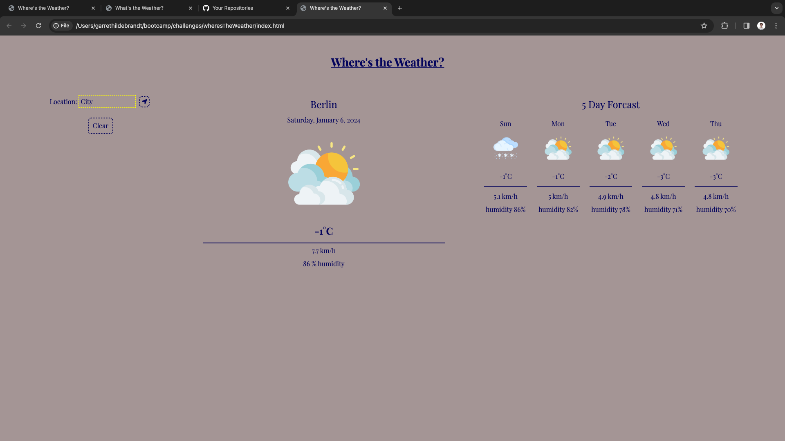
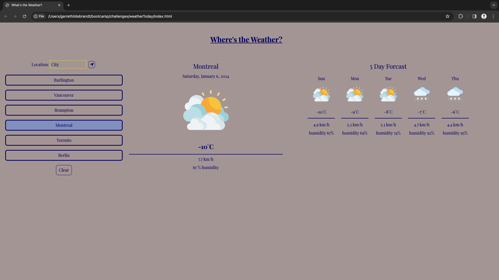

# weatherToday

## Description

weatherToday is meant to provide present and future weather information when the user submits a city name. 

## Installation

N/A

## Usage

The user may enter a city name in the search input area and click the search button to see the weather for that day and the following 5 days. When a city is searched in the search bar that city name will appear in the past locations area bellow the search region. When a city in the past searches area is clicked that weather is shown on the page. To clear the list of past searches you may click the clear button found bellow all the past searches. 

## Credits

N/A

## License

Please refer to the LICENSE found in the Repo.